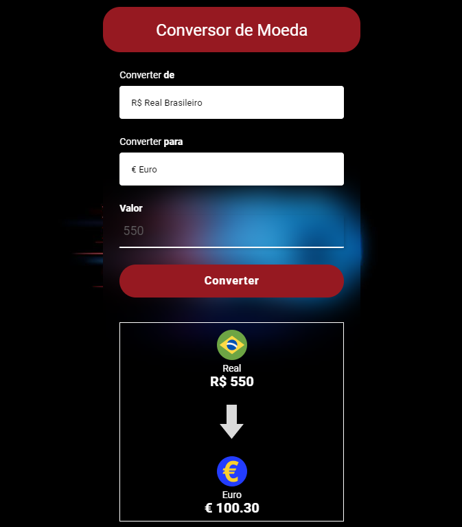
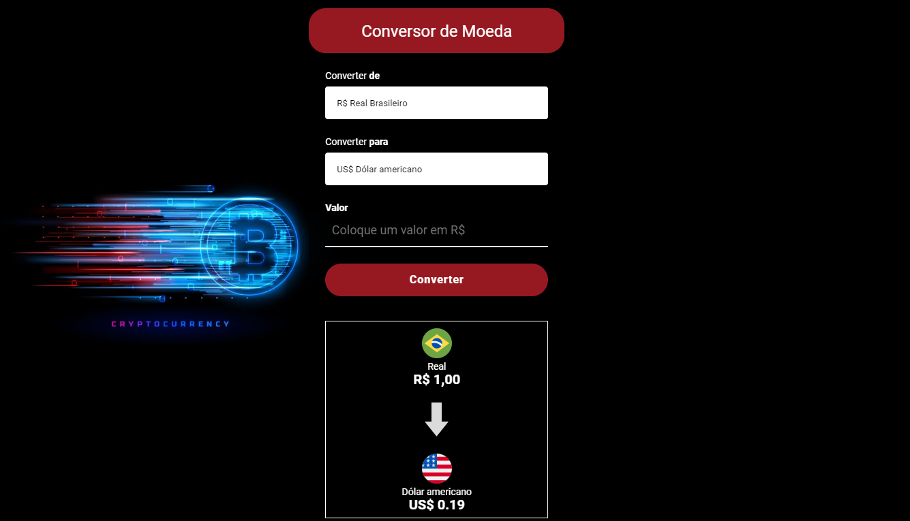

<table align="right">
  <tr>
    <td>
      <a href="readme-en.md">🇺🇸 English</a>
    </td>
  </tr>
  <tr>
    <td>
      <a href="README.md">🇧🇷 Português</a>
    </td>
  </tr>
</table>

# Conversor 💰
| Link do Projeto { <a href= "https://andrecampelor.github.io/Conversor_de_Moeda/"> Conversor de Moeda </a>} |

## Sobre  :memo:
O projeto consiste em um conversor de moedas que converte o valor inserido em Real para a moeda selecionada

As opções de conversão são ( Dolar|Euro|RubloRusso|Yen|Bitcoin )

A cotação é atualizada a cada 30 minutos utilizando a <a href= "http://economia.awesomeapi.com.br"> API </a>

## Layout mobile :iphone:

## Layout web :computer:

### Tecnologias utilizadas :rocket:
- HTML
- CSS
- JS

### Autor  :man_technologist:

André Luiz Campelo

 

