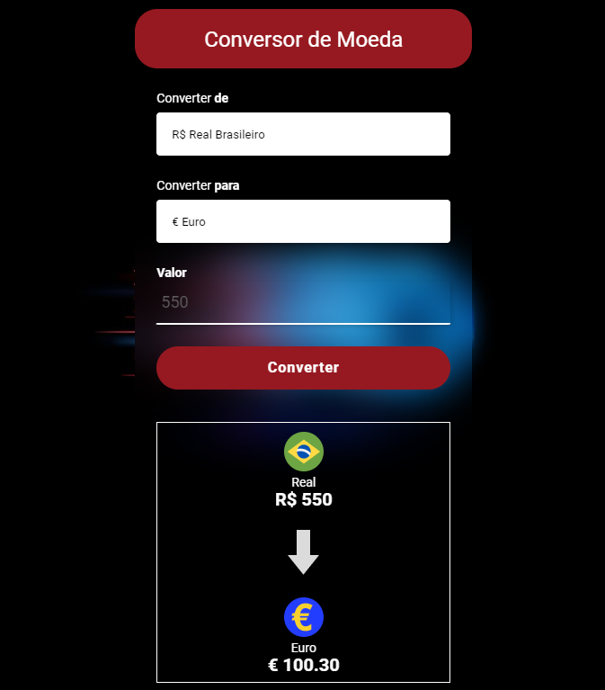
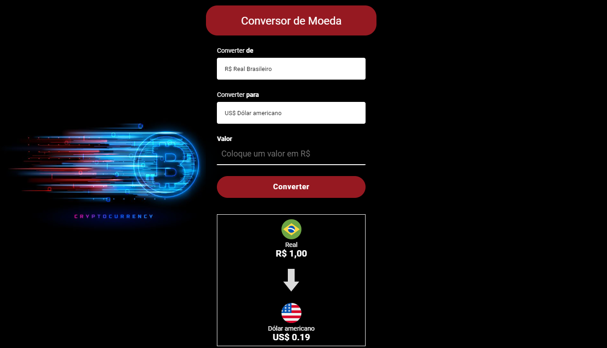

<table align="right">
  <tr>
    <td>
      <a href="readme-en.md">🇺🇸 English</a>
    </td>
  </tr>
  <tr>
    <td>
      <a href="README.md">🇧🇷 Português</a>
    </td>
  </tr>
</table>

# Conversor 💰
| Project Link { <a href= "https://andrecampelor.github.io/Conversor_de_Moeda/"> Currency Converter </a>} |

## About  :memo:
The project consists of a currency converter that converts the entered value in Real for selected currency

The conversion options are ( Dolar|Euro|RubloRusso|Yen|Bitcoin )

the quote is updated every 30 minutes using <a href= "http://economia.awesomeapi.com.br"> API </a>

## Layout mobile :iphone:

## Layout web :computer:

### Technologies Used :rocket:
- HTML
- CSS
- JS

### Author  :man_technologist:

André Luiz Campelo

 
